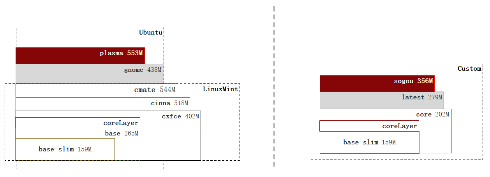

**Producttion**

`AMD64/ARM64` supported, Producttion prefer with `docker-compose`. [docker-compose.yml](./docker-compose.yml) [docker-compose-livecd.yml](./docker-compose-livecd.yml)

- [CloudDesktop](./_doc/CloudDesktop.md)
- [生产部署指引](./_doc/生产部署指引.md)
- [使用手册](./_doc/使用手册.md)
- [适用场景与问题](./_doc/适用场景与问题.md)

**Tags**

 TAG | Distro | DESK | INPUT | STARTER | IMAGE |Star|Descrition 
--- | --- | ---  | ---  | --- | --- | --- | ---
latest |Ubuntu| xfce | ibus  | supervisor | [](https://hub.docker.com/r/infrastlabs/docker-headless/tags)|★★★★★|Customize,Lightweight
sogou  |Ubuntu| xfce | fcitx | supervisor | [](https://hub.docker.com/r/infrastlabs/docker-headless/tags)|★★★★★|sogouInput
core   |Ubuntu| flux | - | supervisor | [](https://hub.docker.com/r/infrastlabs/docker-headless/tags)|★★★★☆|ConfigLayer,Firefox
---|---|---|---|---|---|---
cmate   |Mint| mate | ibus  | systemd | [](https://hub.docker.com/r/infrastlabs/docker-headless/tags)|★★★★★|GoodExperience
cxfce   |Mint| xfce | ibus  | systemd | [](https://hub.docker.com/r/infrastlabs/docker-headless/tags)|★★★★★|Xfce 4.16
cinna   |Mint| cinnamon | ibus  | systemd | [](https://hub.docker.com/r/infrastlabs/docker-headless/tags)|★★★★☆|VideoCard Notify
gnome   |Ubuntu| gnome | ibus  | systemd | [](https://hub.docker.com/r/infrastlabs/docker-headless/tags)|★★★★★|Best Compatible
plasma   |Kubuntu| plasma | ibus  | systemd | [](https://hub.docker.com/r/infrastlabs/docker-headless/tags)|★★★★☆|Black area with Settings

```bash
# non-production usage with default password!!
SSH_PASS=ChangeMe  VNC_PASS=ChangeMe2  VNC_PASS_RO=ChangeMe3
echo "headless:$SSH_PASS" |sudo chpasswd
echo -e "$VNC_PASS\n$VNC_PASS\ny\n$VNC_PASS_RO\n$VNC_PASS_RO"  |sudo vncpasswd /etc/xrdp/vnc_pass; sudo chmod 644 /etc/xrdp/vnc_pass
```

**ImageLayers**



**Detail**

（Hotkeys, Envs, SysApps）

- Size: latest: `168.347 MB`, slim: `88.929 MB`, full: `289.581 MB`
- User: `headless`, SSHPass: `headless`, VNCPass: `headless`, VNCPassReadOnly: `View123`
- Ports
  - novnc 6080 > 10081 (wsvnc+broadcast's mp3-stream)
  - xrdp  3389 > 10089
  - sshd  22   > 10022
  - 
  - vnc: 6000/tcp (+offset: 10)
  - pulse: 4713/tcp (default: uds)
- Entry: xrdp, novnc, dropbear
- oh-my-bash, docker-dind
- Misc: `tree htop gawk expect tmux rsync iproute2`
- GUI: `sakura tint2 plank flameshot`, `gnome-system-monitor engrampa ristretto`
- TZ/Font/Input: tzdata, ttf-wqy-microhei, ibus-rime

**0.HostGUIApps**

```bash
export DISPLAY=:10
export PULSE_SERVER=tcp:127.0.0.1:4721 #audio
# ./guiApps
```

**1.HotKeys**

- HotKeys `super: Alt`
  - `sup+t`: terminal
  - `sup+f`: thunar
  - `sup+d`: rofi
  - `sup+q`: flameshot
  - `sup+h` : hide window
  - `sup+up`: max window
  - `sup+down`: cycle windows
  - `sup+left`: left workspace
  - `sup+right`: right workspace

**2.Env**

```bash
# ENV (default); SSH_PASS=headless, VNC_PASS=headless, VNC_PASS_RO=View123; 
ENV \
  SSH_PORT=10022 \
  RDP_PORT=10089 \
  VNC_PORT=10081 \
  # 
  SSH_PASS=headless \
  VNC_PASS=headless \
  VNC_PASS_RO=View123 \
  # VNC_SSL_ONLY=false \
  # VNC_CERT= \
  VNC_OFFSET=10 \
  L=zh_CN \
  TZ=Asia/Shanghai  
```

**3.Apps**

- xfce4 https://www.xfce.org/projects
- tint2 https://github.com/o9000/tint2
- plank https://github.com/elementary/dock #An elementary fork of Plank
- thunar(lxappearance) https://github.com/xfce-mirror/thunar/graphs/contributors
- geany https://github.com/geany/geany/graphs/contributors #2006+
- sakura https://github.com/dabisu/sakura
- 
- rofi, dunst, conky, dbus #https://github.com/bus1/dbus-broker #https://bus1.org/
- dropbear https://hub.fastgit.org/mkj/dropbear/graphs/contributors
- asbru https://github.com/asbru-cm/asbru-cm #PAC
- ristretto jgmenu compton
- gnome-system-monitor, lxappearance
- gimp, code, idea, browser360, wps
- oth: inkscape, falkon, Xonotic

**4.Refs**

- https://github.com/accetto/xubuntu-vnc-novnc #276.52 MB
- https://github.com/hectorm/docker-xubuntu #633.29 MB
- https://github.com/ConSol/docker-headless-vnc-container
- https://github.com/jlesage/docker-firefox
- https://hub.fastgit.org/aerokube/selenoid
- https://github.com/fadams/docker-gui #book
- https://github.com/frxyt/docker-xrdp #DE
