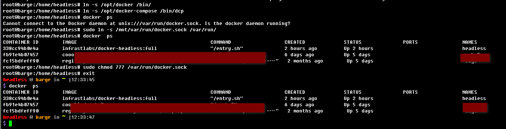

# Docker云桌面（docker-healess）

[](https://hub.docker.com/r/infrastlabs/docker-headless/tags)
[](https://hub.docker.com/r/infrastlabs/docker-headless/tags)
[](https://hub.docker.com/r/infrastlabs/docker-headless/tags)
[](https://hub.docker.com/r/infrastlabs/docker-headless)
[](https://www.github.com/infrastlabs/docker-headless)
[](https://www.github.com/infrastlabs/docker-headless/issues)

开源Docker的远程开发/办公运维的桌面环境 (Debian+XRDP/NOVNC+XFCE4)

- 支持双屏显示，远程声音
- SSH连接,RDP远程,WEB浏览器访问(novnc)
- 多语言本土化，中文输入法(五笔/拼音)
- 桌面：Xfce4, Mate, Fluxbox, ..（默认: xfce4）
- 发行版：Debian9/10/11, Ubuntu1804/2004, .. （默认: debian9）
- 精简小巧 `丐版: 95M(无音频面板)`, `豪华版: 167M(latest默认,无本土化)`, `旗舰版: 287M`

## 快速开始

`docker run -it --rm --shm-size 1g --net=host infrastlabs/docker-headless`

 -- | 连接 | 密码 | 只读密码 
--- | ---  | ---  | ---
noVnc | http://192.168.0.x:10081 | `headless` | `View123` 
Audio | http://192.168.0.x:10082 |     -      | - 
RDP   | 192.168.0.x:10089        | `headless` | - 
SSH   | ssh -p 10022 headless@192.168.0.x | `headless` | - 

**(1)密码修改**: 生产禁用默认密码，初始后请修改!!

```bash
# 动态修改密码：
SSH_PASS=xxx  VNC_PASS=xxx2  VNC_PASS_RO=xxx3
echo "headless:$SSH_PASS" |sudo chpasswd
echo -e "$VNC_PASS\n$VNC_PASS\ny\n$VNC_PASS_RO\n$VNC_PASS_RO"  |sudo vncpasswd /etc/xrdp/vnc_pass; sudo chmod 644 /etc/xrdp/vnc_pass
```

**(2)使用帮助**: 

- [云桌面功能简介](./docs/01-CloudDesktop.md)
- [1.如何设置为中文或其它语言？](./docs/b1-locale.md)
- [2.双屏连接，远程剪切板、音频如何使用？](./docs/b2-rdp.md)
- [3.如何WEB访问远程桌面？](./docs/b3-vnc.md)
- [4.中文输入法、截图软件使用说明](./docs/b4-apps.md)
- [5.音乐播放器及远程音频相关说明](./docs/b5-audio.md)
- [6.如何使用Ubuntu, Mate等其它桌面](./docs/b6-desktop.md) TODO
- [Detail明细说明](./detail.md) （快捷键、环境变量、系统应用）


**(3)生产部署指引**: 

- [Windows虚拟机部署：](./deploy/win-vbox/README.md) 采用barge-os迷你容器系统, --net=host 采用虚机IP 
- [Linux服务器部署：](./deploy/fat-docker/README.md) 容器使用macvlan网络，分配专用IP，建议安装lxcfs
- [K8S内部署：](./deploy/k8s-headless/README.md) Deployment+Service

## 使用示例

中文版快速体验: `docker run -it --rm --shm-size 1g -e VNC_OFFSET=20 -e L=zh_CN --net=host infrastlabs/docker-headless:full`, 推荐[docker-compose.yml](./docker-compose.yml)

**(1)Dev开发环境搭建** (java, golang, nodejs)

```bash
# JAVA
sudo apt -y install openjdk-8-jdk openjdk-8-source && sudo apt -y install maven 
# GO
wget https://studygolang.com/dl/golang/go1.13.15.linux-amd64.tar.gz
tar -zxf go1.13.15.linux-amd64.tar.gz; mv go go1.13.15.linux-amd64
# NODE
wget https://npm.taobao.org/mirrors/node/v14.13.1/node-v14.13.1-linux-x64.tar.xz
xz -d node-v14.13.1-linux-x64.tar.xz #tar.xz消失
tar -xvf node-v14.13.1-linux-x64.tar

cat >> /etc/profile <<EOF
# NODE
NODE_HOME=/_ext/down/node-v14.13.1-linux-x64
PATH=\$PATH:\$NODE_HOME/bin
export NODE_HOME PATH
# GO
GO_HOME=/_ext/down/go1.13.15.linux-amd64
GOPATH=/_ext/gopath
PATH=\$PATH:\$GO_HOME/bin:\$GOPATH/bin
export GO_HOME GOPATH PATH
export GO111MODULE=on
export GOPROXY=https://goproxy.cn
EOF

#IDE: vscode, ideaIC
# wget https://vscode.cdn.azure.cn/stable/91899dcef7b8110878ea59626991a18c8a6a1b3e/code_1.47.3-1595520028_amd64.deb
# wget https://vscode.cdn.azure.cn/stable/c3f126316369cd610563c75b1b1725e0679adfb3/code_1.58.2-1626302803_amd64.deb
wget https://vscode.cdn.azure.cn/stable/6cba118ac49a1b88332f312a8f67186f7f3c1643/code_1.61.2-1634656828_amd64.deb
wget https://download.jetbrains.8686c.com/idea/ideaIC-2016.3.8-no-jdk.tar.gz
```


**(2)浏览器、Office办公**

wps, chrome/firefox

```bash
# 火狐/谷歌浏览器
sudo apt -y install firefox-esr chromium #chromium-driver
# WPS三件套
# https://blog.csdn.net/u012939880/article/details/89439647 #wps_symbol_fonts.zip
wget https://wdl1.cache.wps.cn/wps/download/ep/Linux2019/10161/wps-office_11.1.0.10161_amd64.deb
# 支持中文输入法
sudo sed -i "1a export XMODIFIERS=@im=ibus" /usr/bin/{wps,wpp,et}
sudo sed -i "2a export QT_IM_MODULE=ibus" /usr/bin/{wps,wpp,et}
```


**(3)Docker Dind模式**

支持在容器内调用宿主机的dockerd，用于dockerfile构建、容器控制等场景。



```bash
# 宿主机运行：获取docker,docker-compose文件:
img=docker:18.09.8 #18.09.3
docker run -v /_ext:/mnt $img sh -c "cp /usr/local/bin/docker /mnt; ls -lh /mnt |grep docker"
img=registry.cn-shenzhen.aliyuncs.com/k-bin/sync-kube:kube-att
docker run --rm -v /_ext:/mnt $img sh -c 'cp -a /down/docker-compose /mnt/; ls -lh /mnt |grep docker'

# 软链接: docker, socket
ls /_ext/ |grep docker
sudo bash -c "ln -s /_ext/docker /bin/; ln -s /_ext/docker-compose /usr/bin/dcp"
sudo bash -c "ln -s /mnt/var/run/docker.sock /var/run/; chmod 777 /var/run/docker.sock"
```
