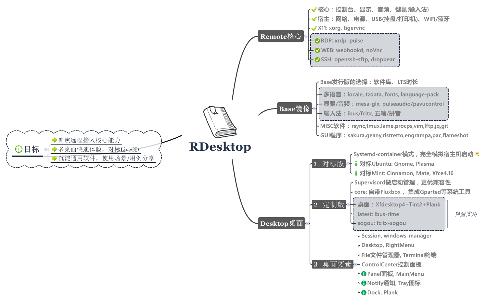
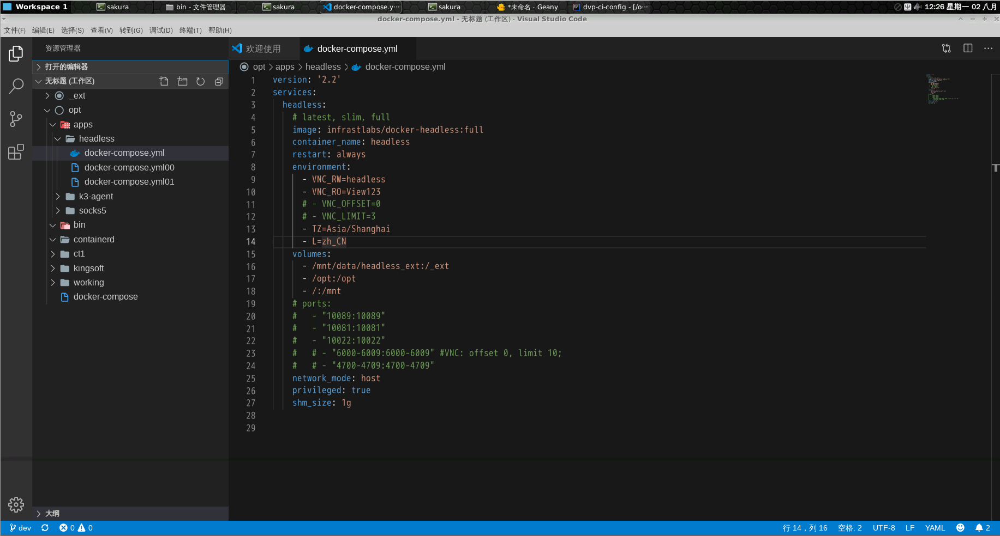

**Docker云桌面**（docker-headless）

基于`Ubuntu20.04`胖容器+远程接入, 实现`Linux`下私人桌面、云端办公。在生产跑浏览器做调试/维护。在服务器搭建专用开发环境，公司/Home互通办公。镜像体积小、支持多语言、提供多桌面

[](https://hub.docker.com/r/infrastlabs/docker-headless/tags)
[](https://hub.docker.com/r/infrastlabs/docker-headless)
[](https://www.github.com/infrastlabs/docker-headless)
[](https://www.github.com/infrastlabs/docker-headless/issues)

**一、快速开始**

`docker run -it --rm --shm-size 1g --net=host infrastlabs/docker-headless`

 -- | 连接 | 密码 | 只读密码 
--- | ---  | ---  | ---
noVnc | http://192.168.0.x:10081 | `headless` | `View123` 
RDP   | 192.168.0.x:10089        | `headless` | - 
SSH   | ssh -p 10022 headless@192.168.0.x | `headless` | - 


**二、设计说明**

- 容器：环境固化、宿主隔离、胖容器/虚拟机
- 桌面：远程共享、双屏支持(RDP)、只读屏幕(noVNC)
- 特色：远程音频、本土化、输入法(五笔/拼音)
- 多桌面：Xfce,Mate,Cinnamon,Gnome,Plasma
- 小体积：镜像层复用、小巧精简 `core: 170.53 MB`, `latest: 277.48 MB`, `sogou: 354.15 MB`



**三、使用示例**

多语言快速体验: `docker run -it --rm --shm-size 1g -e VNC_OFFSET=20 -e L=zh_CN --net=host infrastlabs/docker-headless:latest`, 推荐[docker-compose.yml](./docker-compose.yml)

**(1)Dev开发环境搭建** (java, golang, nodejs)

```bash
# JAVA
sudo apt -y install openjdk-8-jdk openjdk-8-source && sudo apt -y install maven 
# GO
goVer=go1.17.8 #go1.16.15 #go1.13.15
wget https://studygolang.com/dl/golang/$goVer.linux-amd64.tar.gz
tar -zxf $goVer.linux-amd64.tar.gz; mv go $goVer.linux-amd64
rm -f godev; ln -s $goVer.linux-amd64 godev #link godev
# NODE
wget https://npm.taobao.org/mirrors/node/v14.20.0/node-v14.20.0-linux-x64.tar.xz
xz -d node-v14.20.0-linux-x64.tar.xz #tar.xz消失
tar -xvf node-v14.20.0-linux-x64.tar

# cat >> /etc/profile <<EOF
cat <<EOF |sudo tee -a /etc/profile
# NODE
NODE_HOME=/_ext/down/node-v14.20.0-linux-x64
PATH=\$NODE_HOME/bin:\$PATH
export NODE_HOME PATH
# GO
GO_HOME=/_ext/down/godev
GOPATH=/_ext/gopath
PATH=\$GO_HOME/bin:\$GOPATH/bin:\$PATH
export GO_HOME GOPATH PATH
export GO111MODULE=on
export GOPROXY=https://goproxy.cn
EOF

#IDE: vscode, ideaIC
# wget https://vscode.cdn.azure.cn/stable/91899dcef7b8110878ea59626991a18c8a6a1b3e/code_1.47.3-1595520028_amd64.deb
# wget https://vscode.cdn.azure.cn/stable/c3f126316369cd610563c75b1b1725e0679adfb3/code_1.58.2-1626302803_amd64.deb
wget https://vscode.cdn.azure.cn/stable/6cba118ac49a1b88332f312a8f67186f7f3c1643/code_1.61.2-1634656828_amd64.deb
#wget https://download.jetbrains.8686c.com/idea/ideaIC-2016.3.8-no-jdk.tar.gz
wget https://download.jetbrains.com.cn/idea/ideaIC-2016.3.8-no-jdk.tar.gz
```



**(2)浏览器、Office办公**

wps, chrome/firefox

```bash
# 火狐/谷歌浏览器
sudo apt -y install firefox-esr chromium #chromium-driver
# 网易云音乐
wget https://d1.music.126.net/dmusic/netease-cloud-music_1.2.1_amd64_ubuntu_20190428.deb
# WPS三件套
# https://blog.csdn.net/u012939880/article/details/89439647 #wps_symbol_fonts.zip
wget https://wdl1.cache.wps.cn/wps/download/ep/Linux2019/10161/wps-office_11.1.0.10161_amd64.deb
# 支持中文输入法
sudo sed -i "1a export XMODIFIERS=@im=ibus" /usr/bin/{wps,wpp,et}
sudo sed -i "2a export QT_IM_MODULE=ibus" /usr/bin/{wps,wpp,et}
```


**(3)Docker Dind模式**

支持在容器内调用宿主机的dockerd，用于dockerfile构建、容器控制等场景。


```bash
# 宿主机运行：获取docker,docker-compose文件:
img=docker:18.09.8 #18.09.3
docker run -v /_ext:/mnt $img sh -c "cp /usr/local/bin/docker /mnt; ls -lh /mnt |grep docker"
img=registry.cn-shenzhen.aliyuncs.com/k-bin/sync-kube:kube-att
docker run --rm -v /_ext:/mnt $img sh -c 'cp -a /down/docker-compose /mnt/; ls -lh /mnt |grep docker'

# 软链接: docker, socket
ls /_ext/ |grep docker
sudo bash -c "ln -s /_ext/docker /bin/; ln -s /_ext/docker-compose /usr/bin/dcp"
sudo bash -c "ln -s /mnt/var/run/docker.sock /var/run/; chmod 777 /var/run/docker.sock"
```
