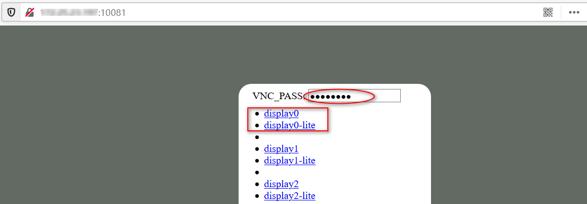

# CloudDesktop简介

镜像体积小、支持多语言、提供多桌面。Web,RDP,SSH多种远程接入

## 一、WEB浏览器

- HTTP/HTTPS双协议
- lite/full两种模式
- 多实例支持(vnc_server)
- 与rdp桌面共享
- 双密码：可操控+只读



## 二、RDP客户端

mstisc/mRemoteNG

- 双屏显示
- 远程声音
- 双向剪切板(文本、文件)
- 本地磁盘挂载


## 三、多语言

```bash
# LOCALE
- pt_PT es_ES fr_FR de_DE ru_RU it_IT nl_NL cs_CZ tr_TR ar_EG
- zh_CN zh_HK zh_TW ko_KR ja_JP 
# TZ 时区
- Asia/Shanghai (default)
- Etc/GMT-8 #东八区
```


## 四、桌面应用

- IBUS/Fcitx输入法(rime/sogou中文)
- Flameshot截图
- PAC终端管理、oh-my-bash


