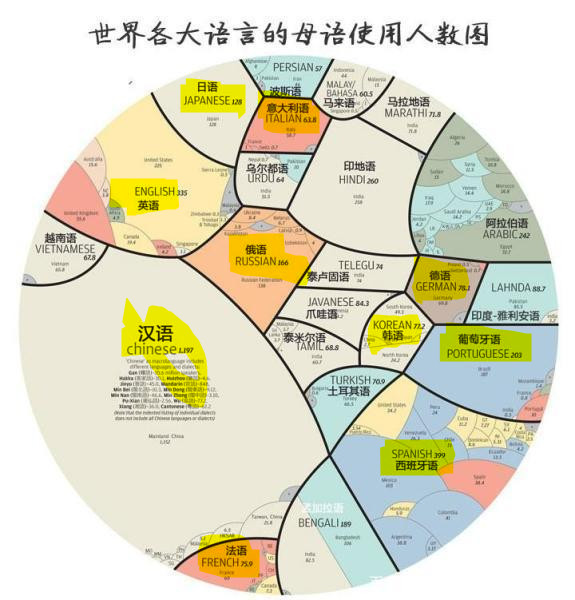

# Locale/TZ

- https://www.best73.com/news/100331.html 全球十大主流语言排名
- https://blog.csdn.net/shenenhua/article/details/79150053 语言(文化)代码与国家地区对照表

本地化: `docker run -it --rm --shm-size 1g -e VNC_OFFSET=20 -e L=zh_CN --net=host infrastlabs/docker-headless:full`, 推荐[docker-compose.yml](../docker-compose.yml)

环境变量：  
- L=zh_CN 设置语言
- TZ=Asia/Shanghai 设置时区



```bash
# 支持语言列表：
LOCALE_INCLUDE="zh_CN zh_HK zh_TW en en_CA es es_AR fr fr_CA pt pt_BR ar cs de it ja ko nl ru tr vi"
# zh_CN zh_HK zh_TW
en en_CA es es_AR pt pt_BR fr fr_CA 
ar cs de it ja ko nl ru tr vi


# L=zh_CN; L=zh_HK; L=zh_TW; 中文
L=pt_PT 葡萄牙
L=es_ES 西班牙语(西班牙)
L=fr_FR 法
L=de_DE 德
L=ru_RU 俄
L=it_IT 意
L=ko_KR 韩
L=ja_JP 日
L=nl_NL 荷兰语(荷兰)
L=cs_CZ 捷克语(捷克共和国)
# https://blog.csdn.net/shenenhua/article/details/79150053
L=tr_TR 土耳其语 -土耳其 
L=ar_EG 阿拉伯语 -埃及 
L=vi_VN 越南 -越南
```

- zh_CN 
- zh_HK 
- zh_TW 
- 
- 1pt_PT 
- 2es_ES 
- 3fr_FR 
- 4de_DE 
- 5ru_RU 
- 6it_IT 
- 7ko_KR 
- 8ja_JP 
- 9nl_NL 
- 10cs_CZ 
- 11tr_TR 
- 12ar_SA 

## 附

```bash
# 语言代码列表
国家/地区	语言代码	
韩文(韩国)	ko_KR       ==
日语(日本)	ja_JP       ==
荷兰语(荷兰)	nl_NL   ==
荷兰语(比利时)	nl_BE
葡萄牙语(葡萄牙)	pt_PT   ==
葡萄牙语(巴西)	    pt_BT
法语(法国)	    fr_FR      ==
法语(卢森堡)	fr_LU
法语(瑞士)	    fr_CH
法语(比利时)	fr_BE
法语(加拿大)	fr_CA	
西班牙语(拉丁美洲)	es_LA
西班牙语(西班牙)	es_ES	==
西班牙语(阿根廷)	es_AR
西班牙语(美国)	    es_US
西班牙语(墨西哥)	es_MX
西班牙语(哥伦比亚)	es_CO	
西班牙语(波多黎各)	es_PR

德语(德国)	    de_DE  ==
德语(奥地利)	de_AT
德语(瑞士)	    de_CH	
俄语(俄罗斯)	ru_RU
意大利语(意大利)	it_IT	==
希腊语(希腊)	    el_GR
挪威语(挪威)	    no_NO	--
匈牙利语(匈牙利)	hu_HU
土耳其语(土耳其)	tr_TR	
捷克语(捷克共和国)	cs_CZ   ==
斯洛文尼亚语	sl_SL
波兰语(波兰)	pl_PL
瑞典语(瑞典)	sv_SE	
西班牙语(智利)

简体中文(中国)      zh_CN
繁体中文(台湾地区)	zh_TW
繁体中文(香港)	    zh_HK
英语(香港)	en_HK
英语(美国)	en_US	
英语(英国)	en_GB
英语(全球)	en_WW	
英语(加拿大)	en_CA
英语(澳大利亚)	en_AU	
英语(爱尔兰)	en_IE
英语(芬兰)   	en_FI
芬兰语(芬兰)	fi_FI
英语(丹麦)	    en_DK	
丹麦语(丹麦)	da_DK
英语(以色列)	en_IL	
希伯来语(以色列) he_IL
英语(南非)	en_ZA
英语(印度)	en_IN
英语(挪威)	en_NO	
英语(新加坡)	en_SG
英语(新西兰)	en_NZ	
英语(印度尼西亚) en_ID
英语(菲律宾)	en_PH
英语(泰国)	    en_TH
英语(马来西亚)	en_MY
英语(阿拉伯)	en_XA
```

- 语言(文化)代码与国家地区对照表

```bash
af 公用荷兰语
af-ZA 公用荷兰语 - 南非
sq 阿尔巴尼亚
sq-AL 阿尔巴尼亚 -阿尔巴尼亚
ar 阿拉伯语
ar-EG 阿拉伯语 -埃及
    ar-DZ 阿拉伯语 -阿尔及利亚
    ar-BH 阿拉伯语 -巴林
    ar-IQ 阿拉伯语 -伊拉克
    ar-JO 阿拉伯语 -约旦
    ar-KW 阿拉伯语 -科威特
    ar-LB 阿拉伯语 -黎巴嫩
    ar-LY 阿拉伯语 -利比亚
    ar-MA 阿拉伯语 -摩洛哥
    ar-OM 阿拉伯语 -阿曼
    ar-QA 阿拉伯语 -卡塔尔
    ar-SA 阿拉伯语 - 沙特阿拉伯
    ar-SY 阿拉伯语 -叙利亚共和国
    ar-TN 阿拉伯语 -北非的共和国
    ar-AE 阿拉伯语 - 阿拉伯联合酋长国
    ar-YE 阿拉伯语 -也门
hy 亚美尼亚
hy-AM 亚美尼亚的 -亚美尼亚
az Azeri
az-AZ-Cyrl Azeri-(西里尔字母的) 阿塞拜疆
az-AZ-Latn Azeri(拉丁文)- 阿塞拜疆
eu 巴斯克
eu-ES 巴斯克 -巴斯克
be Belarusian
be-BY Belarusian-白俄罗斯
bg 保加利亚
bg-BG 保加利亚 -保加利亚
ca 嘉泰罗尼亚
ca-ES 嘉泰罗尼亚 -嘉泰罗尼亚
zh-CN 华 -中国
    zh-HK 华 - 香港的 SAR
    zh-MO 华 - 澳门的 SAR
    zh-CHS 华 (单一化)
    zh-SG 华 -新加坡
    zh-TW 华 -台湾
    zh-CHT 华 (传统的)
hr 克罗埃西亚
hr-HR 克罗埃西亚 -克罗埃西亚
cs 捷克
cs-CZ 捷克 - 捷克
da 丹麦文
da-DK 丹麦文 -丹麦
div Dhivehi
div-MV Dhivehi-马尔代夫
nl 荷兰
nl-BE 荷兰 -比利时
nl-NL 荷兰 - 荷兰
en 英国
en-US 英国 - 美国
    en-AU 英国 -澳洲
    en-BZ 英国 -伯利兹
    en-CA 英国 -加拿大
    en-CB 英国 -加勒比海
    en-IE 英国 -爱尔兰
    en-JM 英国 -牙买加
    en-NZ 英国 - 新西兰
    en-PH 英国 -菲律宾共和国
    en-ZA 英国 - 南非
    en-TT 英国 - 千里达托贝哥共和国
    en-GB 英国 - 英国
    en-ZW 英国 -津巴布韦
et 爱沙尼亚
et-EE 爱沙尼亚的 -爱沙尼亚
fo Faroese
fo-FO Faroese- 法罗群岛
fa 波斯语
fa-IR 波斯语 -伊朗王国
fi 芬兰语
fi-FI 芬兰语 -芬兰
fr 法国
fr-FR 法国 -法国
    fr-BE 法国 -比利时
    fr-CA 法国 -加拿大
    fr-LU 法国 -卢森堡
    fr-MC 法国 -摩纳哥
    fr-CH 法国 -瑞士
gl 加利西亚
gl-ES 加利西亚 -加利西亚
ka 格鲁吉亚州
ka-GE 格鲁吉亚州 -格鲁吉亚州
de 德国
de-DE 德国 -德国
    de-AT 德国 -奥地利
    de-LI 德国 -列支敦士登
    de-LU 德国 -卢森堡
    de-CH 德国 -瑞士
el 希腊
el-GR 希腊 -希腊
gu Gujarati
gu-IN Gujarati-印度
he 希伯来
he-IL 希伯来 -以色列
hi 北印度语
hi-IN 北印度的 -印度
hu 匈牙利
hu-HU 匈牙利的 -匈牙利
is 冰岛语
is-IS 冰岛的 -冰岛
id 印尼
id-ID 印尼 -印尼
it 意大利
it-IT 意大利 -意大利
it-CH 意大利 -瑞士
ja 日本
ja-JP 日本 -日本
kn 卡纳达语
kn-IN 卡纳达语 -印度
kk Kazakh
kk-KZ Kazakh-哈萨克
kok Konkani
kok-IN Konkani-印度
ko 韩国
ko-KR 韩国 -韩国
ky Kyrgyz
ky-KZ Kyrgyz-哈萨克
lv 拉脱维亚
lv-LV 拉脱维亚的 -拉脱维亚
lt 立陶宛
lt-LT 立陶宛 -立陶宛
mk 马其顿
mk-MK 马其顿 -FYROM
ms 马来
ms-BN 马来 -汶莱
ms-MY 马来 -马来西亚
mr 马拉地语
mr-IN 马拉地语 -印度
mn 蒙古
mn-MN 蒙古 -蒙古
no 挪威
nb-NO 挪威 (Bokm?l) - 挪威
nn-NO 挪威 (Nynorsk)- 挪威
pl 波兰
pl-PL 波兰 -波兰
pt 葡萄牙
pt-BR 葡萄牙 -巴西
pt-PT 葡萄牙 -葡萄牙
pa Punjab 语
pa-IN Punjab 语 -印度
ro 罗马尼亚语
ro-RO 罗马尼亚语 -罗马尼亚
ru 俄国
ru-RU 俄国 -俄国
sa 梵文
sa-IN 梵文 -印度
sr-SP-Cyrl 塞尔维亚 -(西里尔字母的) 塞尔维亚共和国
sr-SP-Latn 塞尔维亚 (拉丁文)- 塞尔维亚共和国
sk 斯洛伐克
sk-SK 斯洛伐克 -斯洛伐克
sl 斯洛文尼亚
sl-SI 斯洛文尼亚 -斯洛文尼亚
es 西班牙
es-AR 西班牙 -阿根廷
    es-BO 西班牙 -玻利维亚
    es-CL 西班牙 -智利
    es-CO 西班牙 -哥伦比亚
    es-CR 西班牙 - 哥斯达黎加
    es-DO 西班牙 - 多米尼加共和国
    es-EC 西班牙 -厄瓜多尔
    es-SV 西班牙 - 萨尔瓦多
    es-GT 西班牙 -危地马拉
    es-HN 西班牙 -洪都拉斯
    es-MX 西班牙 -墨西哥
    es-NI 西班牙 -尼加拉瓜
    es-PA 西班牙 -巴拿马
    es-PY 西班牙 -巴拉圭
    es-PE 西班牙 -秘鲁
    es-PR 西班牙 - 波多黎各
    es-ES 西班牙 -西班牙
    es-UY 西班牙 -乌拉圭
    es-VE 西班牙 -委内瑞拉
sw Swahili
sw-KE Swahili-肯尼亚
sv 瑞典
sv-FI 瑞典 -芬兰
sv-SE 瑞典 -瑞典
syr Syriac
syr-SY Syriac-叙利亚共和国
ta 坦米尔
ta-IN 坦米尔 -印度
tt Tatar
tt-RU Tatar-俄国
te Telugu
te-IN Telugu-印度
th 泰国
th-TH 泰国 -泰国
tr 土耳其语
tr-TR 土耳其语 -土耳其
uk 乌克兰
uk-UA 乌克兰 -乌克兰
ur Urdu
ur-PK Urdu-巴基斯坦
uz Uzbek
uz-UZ-Cyrl Uzbek-(西里尔字母的) 乌兹别克斯坦
uz-UZ-Latn Uzbek(拉丁文)- 乌兹别克斯坦
vi 越南
vi-VN 越南 -越南
————————————————
# 原文链接：https://blog.csdn.net/shenenhua/article/details/79150053
```

- /usr/share/locale

```bash
$ docker  run -it --rm infrastlabs/docker-headless bash
root@17352c1bb955:/usr/share# du -sh locale
43M	locale
root@47c5a1ccfdea:/home/headless# cd /usr/share/locale
root@47c5a1ccfdea:/usr/share/locale# find |grep "mo$" |cut -d'/' -f2 |sort |uniq -c |sort |wc
    202     404    2383
root@47c5a1ccfdea:/usr/share/locale# find |grep "mo$" |cut -d'/' -f2 |sort |uniq -c |sort    
    #   1 cmn
    #   1 es_AR
    #   1 es_CL
    #   1 es_CO
    #   1 es_CR
    #   1 es_DO
    #   1 es_EC
    #   1 es_MX
    #   1 es_NI
    #   1 es_PA
    #   1 es_PE
    #   1 es_PR
    #   1 es_SV
    #   1 es_UY
    #   1 es_VE
    #   1 fr_CA
    #   1 ig
    #   1 jv
    #   1 ko_KR
    #   1 ks
    #   1 ku_IQ
    #   1 lb
    #   1 lg
    #   1 li
    #   1 mg
    #   1 nds
    #   1 pms
    #   1 sma
    #   1 tt_RU
    #   1 uz@Latn
    #   1 yi
    #   2 ab
    #   2 ace
    #   2 ach
    #   2 ak
    #   2 an
    #   2 ay
    #   2 ba
    #   2 bar
    #   2 bi
    #   2 ca@valencia
    #   2 ce
    #   2 ch
    #   2 chr
    #   2 csb
    #   2 cv
    #   2 dv
    #   2 ee
    #   2 en
    #   2 es_ES
    #   2 ff
    #   2 gd
    #   2 gn
    #   2 gv
    #   2 ht
    #   2 io
    #   2 iu
    #   2 jam
    #   2 kab
    #   2 ki
    #   2 kl
    #   2 kv
    #   2 kw
    #   2 lo
    #   2 mhr
    #   2 my
    #   2 na
    #   2 nah
    #   2 nv
    #   2 pap
    #   2 pi
    #   2 sd
    #   2 son
    #   3 be@tarask
    #   3 ckb
    #   3 fa_IR
    #   3 frp
    #   3 fur
    #   3 fy
    #   3 ha
    #   3 haw
    #   3 mai
    #   3 mo
    #   3 so
    #   3 sw
    #   3 wal
    #   3 yo
    #   3 zh_Hant
    #   4 fo
    #   4 kok
    #   4 tg
    #   4 tk
    #   4 wo
    #   5 bn_IN
    #   5 ia
    #   5 ky
    #   5 nb_NO
    #   6 en_CA
    #   6 km
    #   6 tl
    #   7 as
    #   7 byn
    #   7 dz
    #   7 gez
    #   7 mt
    #   7 ti
    #   7 tig
    #   7 tt@iqtelif
    #   7 uz
    #   8 af
    #   8 hy
    #   8 ka
    #   8 ku
    #   8 mi
    #   8 ps
    #   8 tt
    #   8 xh
    #   8 zu
    #   9 mk
    #   9 ne
    #   9 or
    #   9 rw
    #   9 ve
    #  10 az
    #  10 crh
    #  10 ie
    #  10 kn
    #  10 mn
    #  10 nso
    #  10 wa
     11 gu
     11 hy_AM
     11 ml
     11 ur_PK
     12 br
     12 fa
     12 hi
     12 mr
     12 ta
     13 ga
     13 ur
     14 cy
     14 en_AU
     14 si
     15 sc
     16 bs
     17 am
     17 en_GB
     17 sr@latin
     17 ug
     18 sq
     18 zh_HK
     19 bn
     19 eo
     19 kk
     19 te
     21 ms
     22 pa
     24 oc
     26 lv
     27 be
     27 is
     27 nn
     27 sl
     28 et
     28 vi
     29 he
     29 nb
     30 ar
     30 bg
     30 eu
     31 ast
     31 gl
     31 id
     31 sk
     31 th
     32 hr
     32 pt
     32 zh_TW
     33 fi
     33 ko
     33 lt
     33 sr
     34 ca
     34 pt_BR
     34 ro
     34 tr
     35 el
     36 cs
     36 da
     36 ja
     36 nl
     36 ru
     36 zh_CN
     37 es
     37 hu
     38 it
     38 pl
     38 sv
     38 uk
     40 de
     40 fr

# root@47c5a1ccfdea:/usr/share/locale# du -s *  |sort -n |awk '{print $2}' |while read one; do du -sh $one; done
# 0	locale.alias
# 4.0K	ab
# 4.0K	ace
# 4.0K	ak
# 4.0K	an
# 4.0K	ay
# 4.0K	ba
# 4.0K	bi
# 4.0K	ch
# 4.0K	ee
# 4.0K	es_AR
# 4.0K	es_CL
# 4.0K	es_CR
# 4.0K	es_DO
# 4.0K	es_EC
# 4.0K	es_MX
# 4.0K	es_NI
# 4.0K	es_PA
# 4.0K	es_PE
# 4.0K	es_PR
# 4.0K	es_SV
# 4.0K	es_UY
# 4.0K	es_VE
# 4.0K	ff
# 4.0K	fr_CA
# 4.0K	ig
# 4.0K	iu
# 4.0K	jv
# 4.0K	kl
# 4.0K	ko_KR
# 4.0K	ks
# 4.0K	li
# 4.0K	mo
# 4.0K	pap
# 4.0K	pms
# 4.0K	sd
# 4.0K	sma
# 4.0K	uz@Latn
# 4.0K	yi
8.0K	bar
8.0K	chr
8.0K	csb
8.0K	es_CO
8.0K	gd
8.0K	haw
8.0K	ht
8.0K	kab
8.0K	ki
8.0K	ku_IQ
8.0K	kv
8.0K	lg
8.0K	lo
8.0K	mhr
8.0K	na
8.0K	nah
8.0K	nv
8.0K	tt_RU
# 12K	ach
# 12K	ce
# 12K	cv
# 12K	dv
# 12K	es_ES
# 12K	gn
# 12K	gv
# 12K	ha
# 12K	io
# 12K	jam
# 12K	kw
# 12K	nb_NO
# 12K	nds
# 12K	pi
# 12K	so
# 12K	son
# 12K	sw
# 12K	wal
# 12K	zh_Hant
# 16K	ckb
# 16K	fo
# 16K	frp
# 16K	kok
# 16K	mg
# 16K	my
# 16K	yo
# 24K	cmn
# 24K	fur
# 24K	fy
# 24K	ve
# 24K	zu
# 28K	byn
# 28K	gez
# 28K	mi
# 28K	nso
# 28K	ti
# 28K	tig
# 32K	mai
# 32K	wo
# 32K	xh
# 36K	tg
# 36K	tk
# 40K	ca@valencia
# 40K	ia
# 40K	mt
# 40K	tt@iqtelif
# 44K	az
# 44K	ps
# 48K	tt
# 52K	uz
# 64K	af
# 64K	ky
# 68K	mk
# 72K	rw
# 72K	tl
# 76K	lb
# 76K	wa
# 84K	mn
# 88K	be@tarask
# 92K	bn_IN
# 92K	fa_IR
# 92K	ga
# 96K	en_CA
104K	en
112K	br
112K	km
112K	ku
120K	as
120K	bs
120K	cy
120K	hi
120K	si
140K	ka
140K	ne
148K	ml
160K	dz
168K	am
168K	gu
172K	ur_PK
188K	fa
192K	ur
196K	hy
208K	eo
212K	ie
240K	sc
256K	zh_HK
260K	en_AU
276K	hy_AM
280K	sq
288K	sr@latin
296K	oc
296K	te
300K	ms
308K	ug
316K	crh
340K	or
348K	nn
352K	en_GB
356K	et
384K	lv
416K	nb
420K	bn
448K	hr
460K	ar
468K	eu
472K	he
484K	kk
496K	is
500K	ro
512K	kn
532K	fi
540K	ko
552K	sk
560K	pt
560K	sl
568K	zh_TW
576K	pt_BR
580K	ta
588K	vi
592K	bg
604K	mr
616K	ca
620K	cs
636K	lt
648K	pa
720K	es
720K	zh_CN
732K	hu
740K	el
764K	da
764K	th
768K	ast
784K	ja
812K	sr
820K	be
848K	gl
868K	ru
880K	nl
940K	tr
956K	id
960K	pl
1.2M	sv
1.2M	it
1.3M	de
1.3M	fr
1.4M	uk
```

- 100k+, sort2

```bash
root@47c5a1ccfdea:/usr/share/locale# cat ss.txt |awk '{print $2}' |sort |while read one; do cat ss.txt |grep "$one$"; done
168K	am Amharic
# 460K	ar 阿拉伯语
120K	as Assamese
768K	ast
820K	be Belarusian
592K	bg Bulgarian保加利亚
420K	bn Bengali (Bangla)
112K	br Breton
120K	bs
616K	ca Catalan嘉泰罗尼亚
316K	crh
# 620K	cs 捷克
120K	cy Welsh
764K	da
# 1.3M	de 德国
160K	dz
740K	el 希腊
# 104K	en
# 260K	en_AU 英语(澳大利亚)
# 352K	en_GB 英语(英国)
208K	eo
# 720K	es 西班牙
356K	et
468K	eu Basque巴斯克
188K	fa
532K	fi 芬兰语
# 1.3M	fr 法国
848K	gl 加利西亚
168K	gu
472K	he 希伯来
120K	hi
448K	hr Croatian克罗埃西亚
732K	hu Hungarian匈牙利
196K	hy 亚美尼亚
276K	hy_AM 亚美尼亚的 -亚美尼亚
956K	id 印尼
212K	ie
496K	is 冰岛语
# 1.2M	it 意大利
# 784K	ja 日本
140K	ka
484K	kk Kazakh-哈萨克
112K	km
512K	kn 卡纳达语
# 540K	ko 韩国
112K	ku
636K	lt 立陶宛
384K	lv
148K	ml
604K	mr 马拉地语
300K	ms 马来
416K	nb 挪威 (Bokm?l) - 挪威
140K	ne
# 880K	nl 荷兰语
348K	nn 挪威 (Nynorsk)- 挪威
296K	oc
340K	or
648K	pa Punjab 语
960K	pl 波兰
# 560K	pt 葡萄牙
# 576K	pt_BR 葡萄牙 -巴西
500K	ro 罗马尼亚语
# 868K	ru 俄罗斯
240K	sc
120K	si
552K	sk 斯洛伐克
560K	sl 斯洛文尼亚
280K	sq
812K	sr 塞尔维亚 -(西里尔字母的) 
288K	sr@latin
1.2M	sv 瑞典
580K	ta 坦米尔
296K	te
764K	th 泰国
# 940K	tr 土耳其语
308K	ug Uighur
# 1.4M	uk 乌克兰
192K	ur Urdu
172K	ur_PK Urdu-巴基斯坦
# 588K	vi 越南
# 720K	zh_CN
# 256K	zh_HK
# 568K	zh_TW
```

