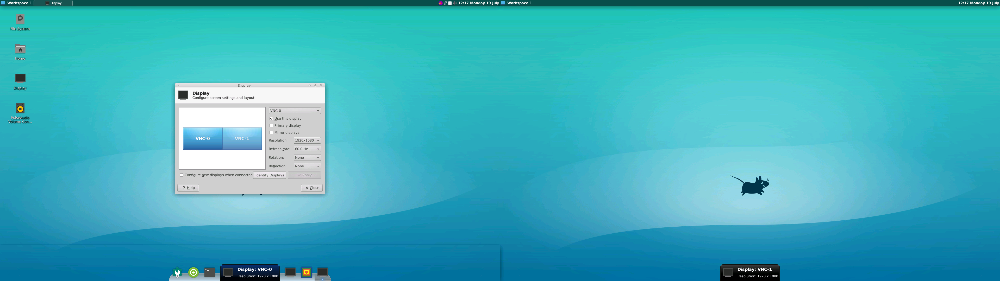
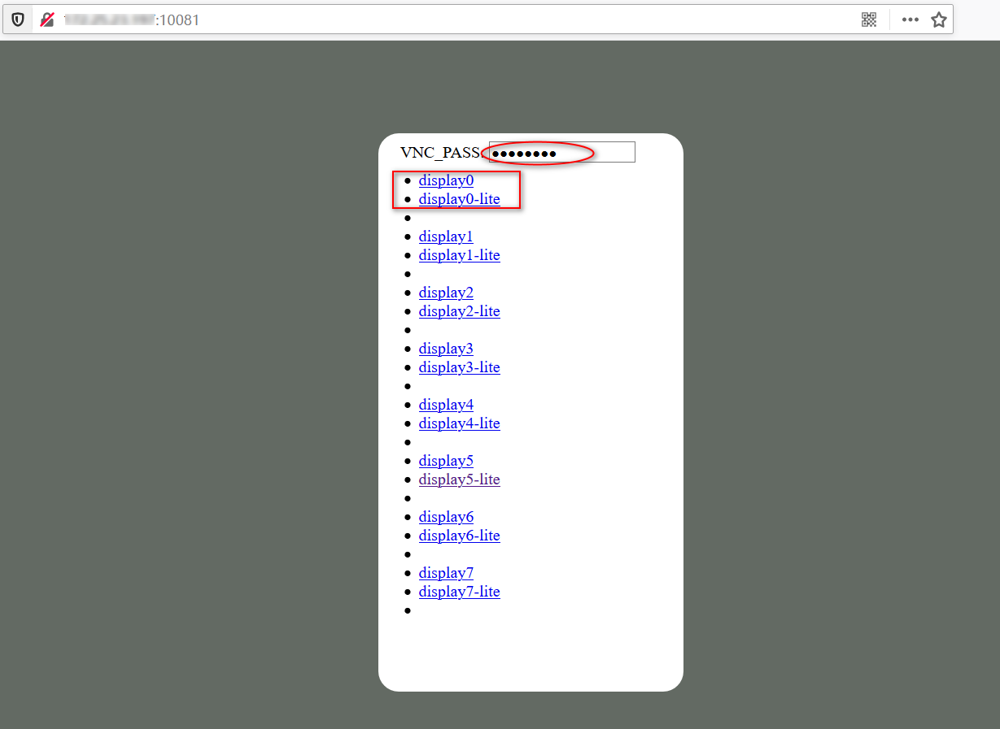

# CloudDesktop

支持SSH,RDP,WEB浏览器3种访问管理方式, 镜像有3个版本，tag标签最新为`box07`。

- `slim`&nbsp;&nbsp;迷你版: ，fluxbox+stterm 只适合做vnc桌面网关
- `latest`豪华版: , xfce+Audio **内置Qmmp音乐播放器**
- `full`&nbsp;&nbsp;&nbsp;旗舰版: , **本土化**、**输入法**、**截屏软件**、**SSH软件**

## 一、RDP客户端访问

- 双屏显示
- 远程声音
- 双向剪切板(文本、文件)
- 本地磁盘挂载

## 二、WEB浏览器远程访问

- HTTP/HTTPS双协议
- lite/full两种模式
- 多实例支持(vnc_server)
- 与rdp桌面共享
- 双密码：可操控+只读

## 三、多语言本地化支持

- LOCALE 多语言
  - pt_PT es_ES fr_FR de_DE ru_RU it_IT nl_NL cs_CZ tr_TR ar_EG
  - zh_CN zh_HK zh_TW ko_KR ja_JP 
- TZ 时区设置
  - Asia/Shanghai (default)
  - Etc/GMT-8 #东八区

## 四、远程桌面应用

- IBUS输入法(rime中文)
- Flameshot截图软件
- PAC终端管理器、oh-my-bash增强

