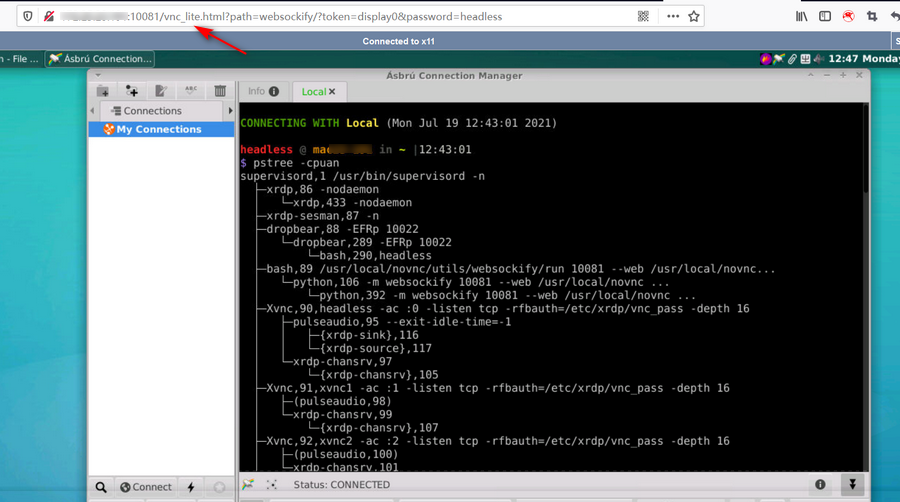
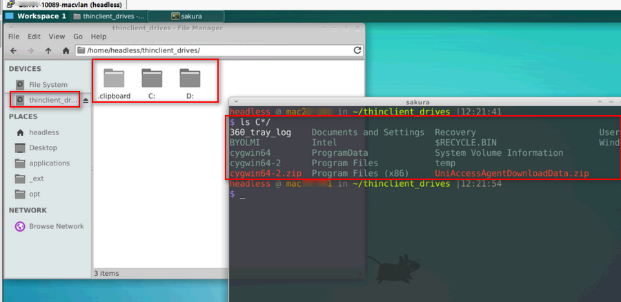
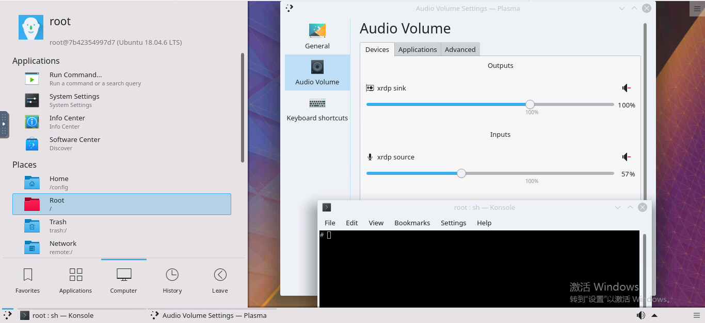
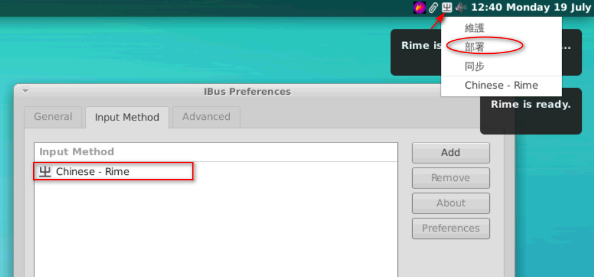
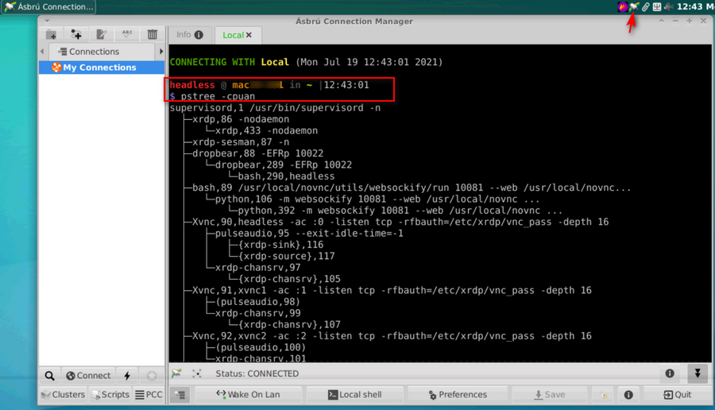

# 使用手册

## 一、WEB访问远程桌面

入口地址：http://192.168.0.x:10081， https://192.168.0.x:10081 (HTTPS默认每次启动时更换SSL证书， 可通过VNC_CERT指定证书)

- 支持HTTP/HTTPS双协议访问
- lite/full两种面板模式
- 密码/只读密码两种交互模式（只读密码 可用于远程教学的屏幕分享）
- 带vnc转发网关功能，支持Xserver多开的访问。

**lite模式**



**full模式** 本地全屏、远程调分辨率、图像质量调节


**多个屏幕访问** 启多个vnc_server

环境变量：VNC_OFFSET=0设定5900的偏移量，VNC_LIMIT=1设定开启VNC服务的个数（默认第1个用于本地桌面环境）

## 二、RDP客户端连接

双屏连接，远程剪切板、音频使用

**1)双屏连接**

目前：windows自带的mstsc连接器支持双屏， mRemoteNG不支持


**2)磁盘映射**




**3)剪切板**

支持剪切板及文件拷贝


**4)RDP音频**

windows下的效果不错， Linux下客户端效果差一点(Remmina)


## 三、使用Mate, Gnome, KDE等桌面

- de2-mate@deb11(三方,英文) 
- de3-xfce@deb11(本地化) 
- de4-kde@ubt1804(三方,英文) 


## 四、远程音频

音乐播放器及远程音频相关说明

**1)Qmmp音乐播放器**

- ling-13400-lstQmmp.sh 获取网上mp3铃声列表，导入Qmmp中播放

**2)noVnc-audio**

```bash
# 22.2.21: DO
use broadcasts-server pulse > ffmpeg > curl > broadcasts-server > client(howlerjs/bc\'s webMainPage)

# 已完成port: 10082； doc: TODO
```

## 五、远程桌面应用

中文输入法、截图软件使用说明

RDP/WEB Locale 桌面应用

**1)IBUS中文输入法**

点击状态样图标，再点击部署，即可输入中文。注：ubuntu2004新版已自动部署



**2)Flameshot截图软件**

快捷键(alt+q)激活区域截图, 或点击状态栏图标截图，选好区域后:右键切换画笔颜色、滚轮改变画笔大小


**3)PAC 远程SSH软件**

集中管理远程ssh连接， 类似windows下的XShell



