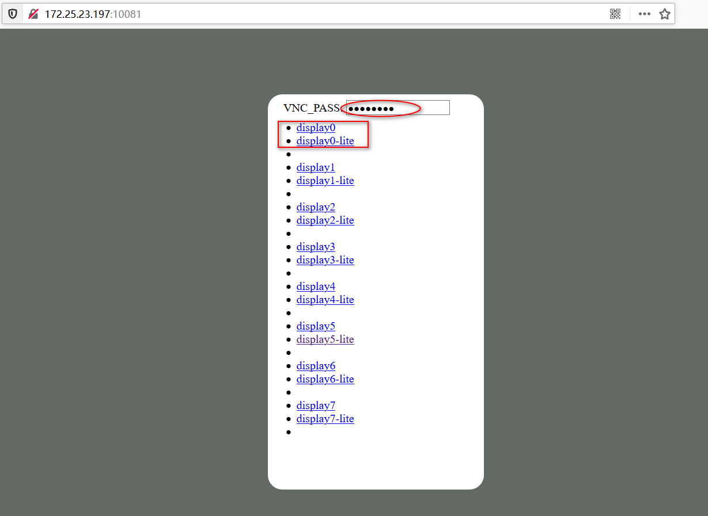

# CloudDesktop

## RDP

- [双屏支持](b1-rdp.md#双屏连接)
- [声音支持](b1-rdp.md#RDP音频)
- [双向剪切板(文本、文件)](b1-rdp.md#剪切板)
- [本地磁盘挂载](b1-rdp.md#磁盘映射)

## VNC

- [noVnc精简版+完整版](b2-vnc.md)
- 多实例支持
- 与rdp桌面共享
- 双密码：可操控+只读

## Locale

- [LOCALE](b0-locale.md)
  - pt_PT es_ES fr_FR de_DE ru_RU it_IT nl_NL cs_CZ tr_TR ar_EG
  - zh_CN zh_HK zh_TW ko_KR ja_JP 
- TZ
  - Asia/Shanghai (default)
  - Etc/GMT-8 #东八区

## 桌面应用

- [IBUS输入法(rime中文)](b3-apps.md#IBUS)
- [Flameshot截图](b3-apps.md#Flameshot)
- [PAC终端管理器、oh-my-bash增强](b3-apps.md#PAC)

