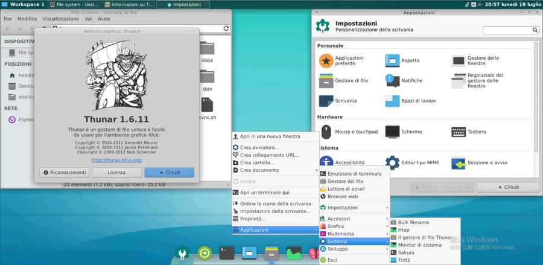
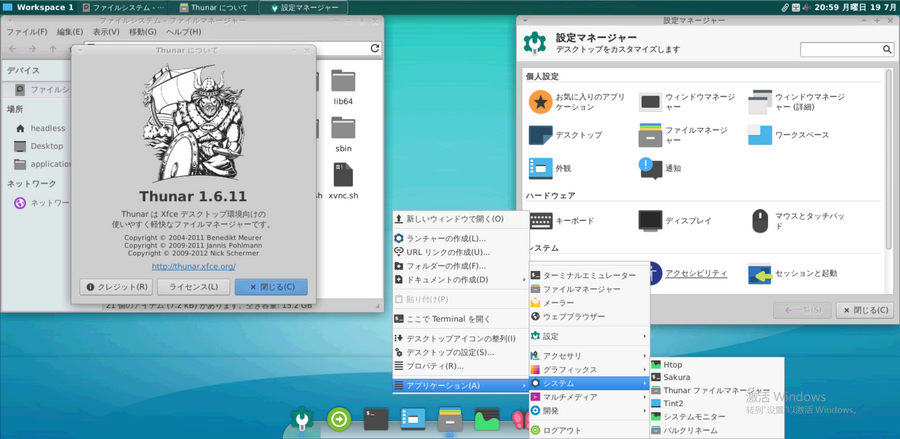
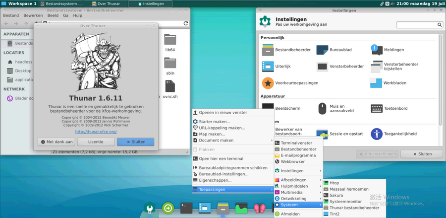
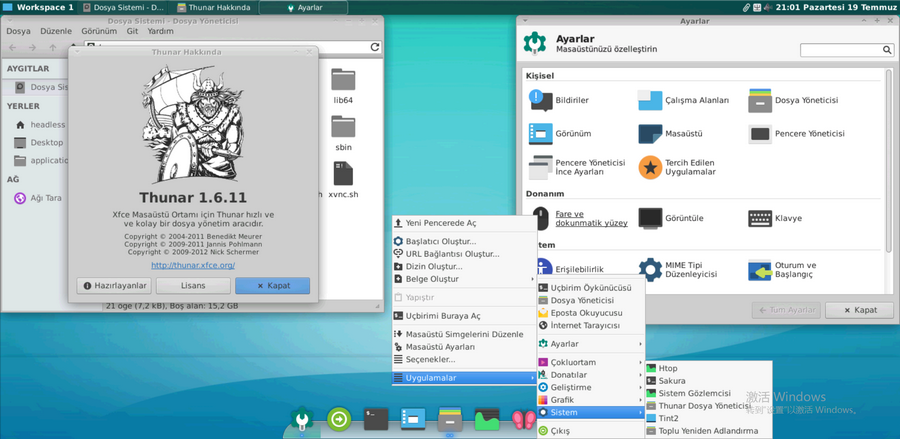
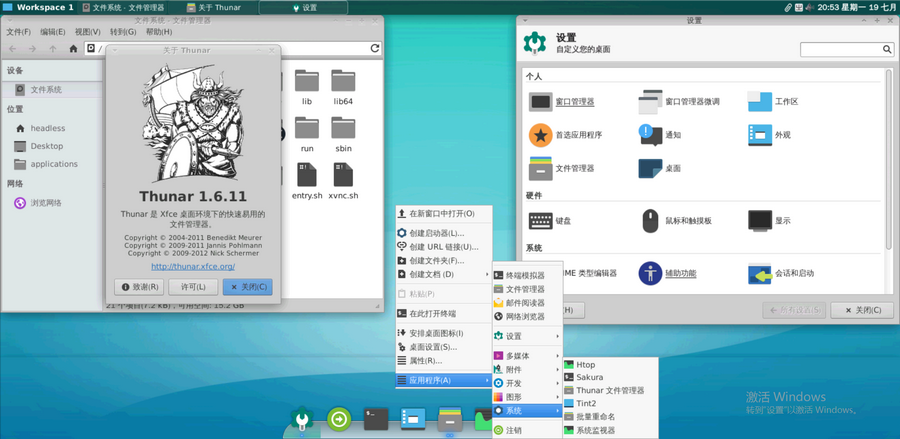

# Locale/TZ

```bash
ls /usr/share/locale1/
ar  cs	de  en  en_CA  es	es_AR  fr  fr_CA  it  ja  ko  nl  pt  pt_BR  ru  tr  vi  zh_CN	zh_HK  zh_TW

L=pt_PT
L=es_ES 西班牙语(西班牙)
L=fr_FR
L=de_DE
L=ru_RU
L=it_IT
L=ko_KR
L=ja_JP
L=nl_NL 荷兰语(荷兰)
L=cs_CZ 捷克语(捷克共和国)
# https://blog.csdn.net/shenenhua/article/details/79150053
L=tr_TR 土耳其语 -土耳其 
L=ar_EG 阿拉伯语 -埃及 
# L=vi_VI 越南 -越南

```

- 
- 
- 
- 
- 
- 
- 
- 
- 
- 
- 
- 
- 
- 
- 
