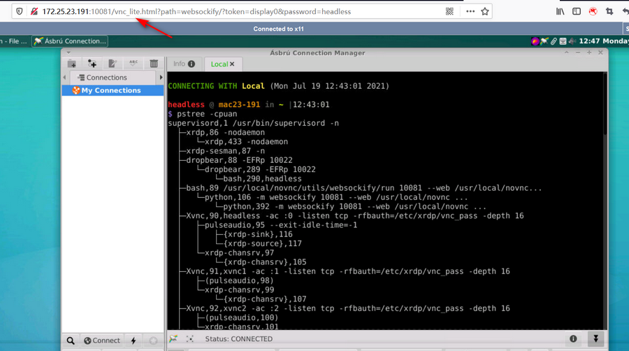
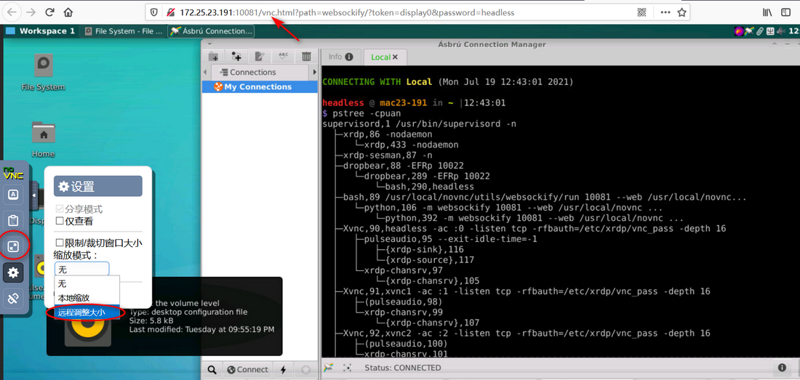

# WEB访问远程桌面

入口地址：http://192.168.0.x:10081， https://192.168.0.x:10081 (HTTPS默认每次启动时更换SSL证书， 可通过VNC_CERT指定证书)

- 支持HTTP/HTTPS双协议访问
- lite/full两种面板模式
- 密码/只读密码两种交互模式（只读密码 可用于远程教学的屏幕分享）
- 带vnc转发网关功能，支持Xserver多开的访问。

**lite模式**

**full模式** 本地全屏、远程调分辨率、图像质量调节

**多个屏幕访问** 启多个vnc_server

环境变量：VNC_OFFSET=0设定5900的偏移量，VNC_LIMIT=1设定开启VNC服务的个数（默认第1个用于本地桌面环境）
