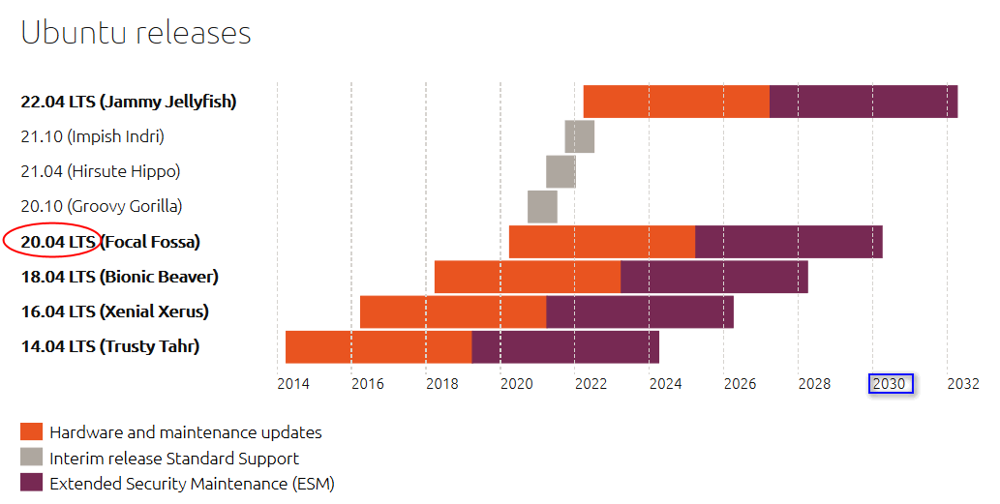
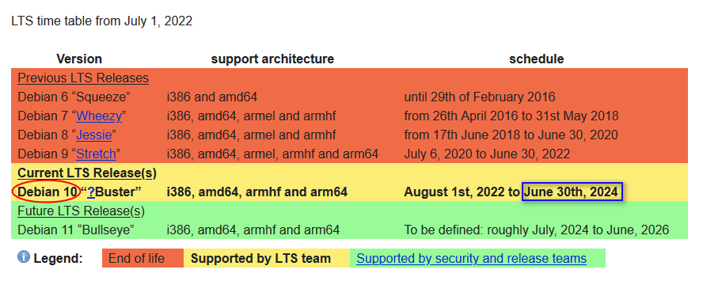

# mint

从../ubuntu[core-v4-slim]继承的定制版，基于mint源安装xfce4.16, 皮肤效果对标deb9，试用项：Fcitx.sogou输入法

- 从deb9演进(debian9 > ubuntu2004), mint主题+xfce4.16+tint2+plank
- 复用基础镜像 `FROM docker-headless:core-v4-slim`
- ~~mint,flux二合一： 考虑多用户，可选桌面..~~

```bash
# 10022, 10089, 10081
# env="-e PORT_SSH=10092 -e PORT_RDP=10099 -e PORT_VNC=10091"
docker run -it --rm --net=host $env -e VNC_OFFSET=10  infrastlabs/docker-headless:mint-v3
# gemmi-deb11 连接本地 声音无延迟、不卡顿
rdesktop localhost:10089 -uabc -pheadless -a 16 -g 1600x1010 -r sound:local
```

**版本选择**

https://wiki.debian.org/LTS  #deb9: (July 6, 2020 to June 30, 2022 )  
https://ubuntu.com/about/release-cycle #ubt20: (2020.4 - 2030.4)



- deb9: 2017, xrdp 0.9.16_OpenSSL 1.1.0l  10 Sep 2019|Xvnc TigerVNC 1.10.0|pulseaudio 10.0
- deb10: 2019, 
- deb11: 2021, 
- ubt18: 
- ubt20: xrdp 0.9.16_OpenSSL 1.1.1f  31 Mar 2020|Xvnc TigerVNC 1.12.0|pulseaudio 13.99.1
- ubt22: 



```bash
# ubt20:
# root@a61211f038fb:/home/headless# Xvnc -version

Xvnc TigerVNC 1.12.0 - built Nov  9 2021 07:58:21
Copyright (C) 1999-2021 TigerVNC Team and many others (see README.rst)
See https://www.tigervnc.org for information on TigerVNC.
Underlying X server release 12013000, The X.Org Foundation
# root@a61211f038fb:/home/headless# xrdp --version
xrdp 0.9.16
  A Remote Desktop Protocol Server.
  Copyright (C) 2004-2020 Jay Sorg, Neutrino Labs, and all contributors.
  See https://github.com/neutrinolabs/xrdp for more information.
  Configure options:
      --prefix=/usr/local/xrdp
      --enable-vsock
      --enable-fdkaac
      --enable-opus
      --enable-fuse
      --enable-mp3lame
      --enable-pixman
      CFLAGS=-Wno-format
  Compiled with OpenSSL 1.1.1f  31 Mar 2020
# root@a61211f038fb:/home/headless# pulseaudio --version
pulseaudio 13.99.1
```

## 问题记录

- ~~pnmixerIcon无显示（出现过一次带themeIcon的，deb9下为原生图标）配置项非系统图标> 再系统图标可显示(papirus)~~
- ~~设置默认bunsen-papirus图标/greybird主题/greybird-compact窗体~~（4.16部分不能按compact效果显示，thunar还可以; > ubt20装xfce414）
- ~~sogou: ctrl+space切换，默认非五笔模式~~.
- 
- rdp长时会断开
- pulse写入满buf后，pavucontrol连不上(191_cent7_多开才有? home_pve5.2下正常)

```bash
# xfdesk/thunar@gemmi-deb11卡死
# root@debian11:/home/headless# cat xfdesk.txt 
kill -9 `ps -ef |grep xfdesk |grep -v grep  |awk '{print }'` && xfdesktop

#xrdp:0.9.5 > 0.9.16 > 0.9.19(导致xfdesk/thunar@gemmi-deb11卡死)
docker  run -v $(pwd)/xrdp:/usr/local/xrdp02 -it --rm --net=host -e VNC_OFFSET=10 -e PORT_RDP=10099 -v $(pwd)/sv2.conf:/etc/supervisor/conf.d/sv.conf registry.cn-shenzhen.aliyuncs.com/infrastlabs/docker-headless:mint-v31


# audio
docker run -it --rm  -p 10092:10022 -p 10099:10089 -p 10091:10081 -e VNC_OFFSET=10  registry.cn-shenzhen.aliyuncs.com/infrastlabs/docker-headless:mint-v3
# docker run -it --rm --net=host -e PORT_SSH=10092 -e PORT_RDP=10099 -e PORT_VNC=10091 -e VNC_OFFSET=10  registry.cn-shenzhen.aliyuncs.com/infrastlabs/docker-headless:mint-v3

http://172.16.xx.xx:10091/vnc/


# xrdp
# deb9 key
root@52f4c229ab33:/etc/xrdp# cp /etc/ssl/certs/ssl-cert-snakeoil.pem /mnt/cert.pem
root@52f4c229ab33:/etc/xrdp# cp /etc/ssl/private/ssl-cert-snakeoil.key /mnt/key.pem
```

